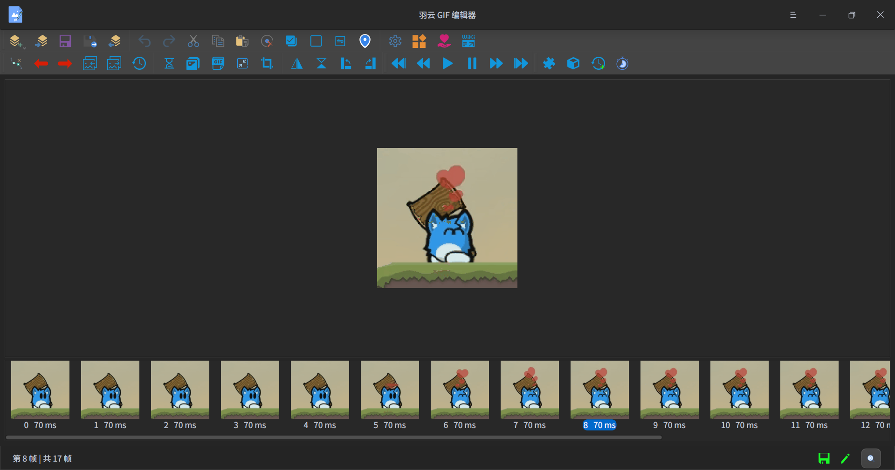

<h1 align="center"> WingSummer.WingGifEditor</h1>

羽云 GIF 编辑器

- 开源不易，给个 Star 或者 [捐助](#捐助) 吧

## WingGifEditor

&emsp;&emsp;本软件是基于 QT 编写的 GIF 编辑器，采用 C++ 进行开发，目的是让 Deepin 上具有简单易用的 GIF 编辑器。`Windows`上有一个十分强大都既是 GIF 录屏工具又是强大 GIF 编辑器`ScreenToGif`。但 Linux 上只有强大的 GIF 录屏工具，但没有简单好用满足基本编辑需求带有图形界面的 GIF 编辑器。于是乎，我给开发了一个简易的 GIF 编辑器，它具有基本的编辑功能，简单方便。

&emsp;&emsp;有关本软件提建议的时候不要天马行空，本软件的定位是提供简单易用满足基本需求的 GIF 编辑器，并不是像`ScreenToGif`，一是没有相关基础知识，自己一个人搞不动；二是没必要，我不想把这个软件搞个大而全，配合`Gimp`等优秀的图像编辑器作为辅助，来编辑 GIF 图像绰绰有余了。

### GIF 库

&emsp;&emsp;本软件基于两个库修改定制而得，一个负责读：`QtGifImage`，另一个负责写：`cgif`。

&emsp;&emsp;`QtGifImage`是`Qt`上的`GIF`读写库，可以将`GIF`解析为`QImage`序列，基于`giflib`。这个我改动比较大，只保留了读取部分，并与我的软件做了适配（这个库写`GIF`图片的质量有点太差），仓库 [链接](https://github.com/jiangcaiyang/QtGifImage) 。

&emsp;&emsp;`cgif`一个快速轻量级的GIF编码器，可以创建 GIF 动画和图像，仓库 [链接](https://github.com/dloebl/cgif) 。

### 编译安装

&emsp;&emsp;由于本软件依赖`Qt`和`DTK`，`DTK`直接在深度应用商店下载就行了。安装完毕后，打开项目，你就可以直接编译该软件了。

### 参与贡献

1. 如果您有想参与本软件代码开发递交，请在 pull request 联系我。
2. 本项目支持捐助，如有意愿请到本仓库通过微信或者支付宝的方式进行，一瓶水的价钱足以提高我的维护该项目的热情，感谢大家的支持。
3. 如果您想提交修复或者增进程序的代码，请在 pull request 递交。
4. 任何成功参与代码 Bug 修复以及增进程序功能的同志和 Sponsor ，都会在本仓库 ReadMe 和附属说明文件中体现，您如果是其中之一，本人可以按照您合理的意愿来进行说明。
  

**加入我们并不意味着就是代码的维护，你可以选择下列一项或多项进行参与：**

1. 代码维护：实现新功能或修复 BUG ，对代码进行维护和升级。
2. 文档编辑：主要是接口文档和教程需要撰写编辑，这很重要。
3. 参与讨论：主要是讨论本项目未来发展和方向等。
4. 编写插件：一起增强该软件的功能。

### 协议

&emsp;&emsp;本软件仓库遵循`AGPL-3.0`协议，不得将本软件用于协议之外的用途。

## 效果图

羽云 GIF 编辑器

## 捐助

**
您的每一份支持都将是本项目推进的强大动力，十分感谢您的支持
**

感谢支持

感谢支持

## 有关仓库

- Gitea : https://code.gitlink.org.cn/wingsummer/WingGifEditor
- Gitee : https://gitee.com/wing-cloud/wing-gif-editor
- Github : https://github.com/Wing-summer/WingGifEditor

## WIKI

&emsp;&emsp;点击 [此链接](https://code.gitlink.org.cn/wingsummer/WingGifEditor/wiki/%E4%BB%8B%E7%BB%8D) 来进行学习使用，可视化的编辑 GIF 。

## 应用商店

&emsp;&emsp;该软件可以通过应用商店进行安装，目前支持的有：深度商店、星火商店。

### 深度商店

&emsp;&emsp;如果你是 Deepin 系统，可以直接从应用商店搜索“羽云 GIF 编辑器”下载：

深度商店

### 星火商店

&emsp;&emsp;如果您安装了星火商店，可以通过它下载安装，会与深度商店的较大或者阶段性更新同步。

星火商店

&emsp;&emsp;Spk分享链接：spk://store/store/com.wingsummer.winggifeditor
